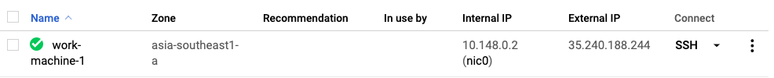

# Working with Bigquery

*   Please be reminded that all of the queries here are made for MIMICiii dataset. If your team is using the (eicu|synthetic) dataset, the name of data hosting project shoud be changed from "physionet-data" to "singapore-datathon-data" and the right tables associated. for example,

```SQL
-- synthetic dataset
SELECT operation_table_code, count(*)
FROM `singapore-datathon-data.synthetic.surgical` 
GROUP BY  operation_table_code
LIMIT 100
```

* Below are the links to the schemas used for this year's Datathon.
	* [MIMICiii](https://mit-lcp.github.io/mimic-schema-spy)
	* [eicu](https://mit-lcp.github.io/eicu-schema-spy)
	* [SYNTHETIC](http://htmlpreview.github.io/?https://github.com/nus-mornin-lab/datathon-gcp-2019/blob/master/bigquery_tutorial/schemas/datadict.html)

*   For Python users, please start from the [Python colab](http://colab.research.google.com/github/GoogleCloudPlatform/healthcare/blob/master/datathon/nusdatathon18/tutorials/bigquery_tutorial.ipynb) (a copy is available in the [tutorials](bigquery_tutorial.ipynb) folder as well), which is a Jupyter notebook hosted in Google Drive, and can be shared with other people for collaboration. It has the most comprehensive examples, including how to train machine learning models on the MIMIC demo dataset with [Tensorflow](https://www.tensorflow.org/).

*   For people who has experience with R, checkout our [R tutorial](bigquery_tutorial.Rmd), which provides an interactive interface to go through the tutorial in RStudio.
    *   Please note that a copy of this tutorial is already included in the RStudio servers running on both the shared and private cloud projects. All you need to do is:
        *   Go to the shared project [singapore-datathon-team](https://console.cloud.google.com/compute/instances?project=singapore-datathon-team)
        *   Find the external IP address of the VM instance under "External IP" column (see the first screenshot below)       
        *   Visit http://EXTERNAL_IP:8787 (e.g. http://35.240.188.244:8787) from a browser.
            *   The username and password should be provided by team leaders from each team.
            
        
        
        

